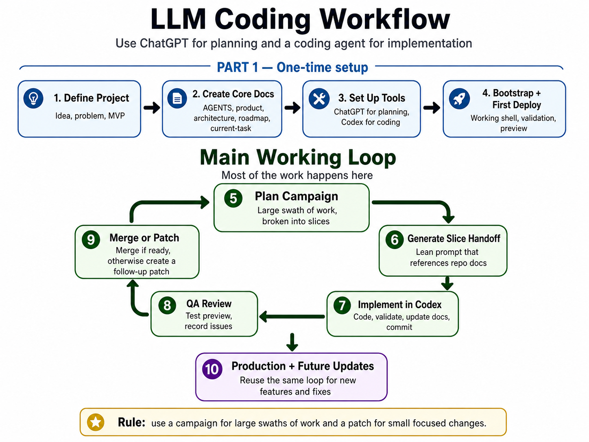

# LLM Coding Workflow Guide

A step-by-step operating guide for using a planning LLM and a coding agent to create, deploy, and maintain software projects.

Current default setup: **ChatGPT for planning** and **Codex for implementation**. The workflow is not limited to web apps. It can support personal apps, scripts, utilities, dashboards, browser games, and other software projects.

## Purpose

This document helps you create a consistent autonomous-coding infrastructure with minimal manual overhead.

The workflow assumes:

- You own product direction and final decisions.
- ChatGPT turns ideas into product plans, repo docs, campaigns, QA decisions, and Codex handoffs.
- Codex implements against the local repo, validates work, updates docs, commits, and reports back.
- GitHub and repo docs are the durable source of truth.
- Windows + PowerShell is the default local environment unless explicitly changed.

The goal is not to create perfect prompts. The goal is to create a repeatable system where every project starts with the same setup, the same documentation structure, and the same implementation loop.

## Why this workflow works

This workflow gives a hobbyist a lightweight version of a professional software process without requiring a professional software team. The core idea is **controlled autonomy**: LLMs do the repetitive planning, coding, documentation, and QA-support work, while the user keeps ownership of product direction, judgment, and final approval.

It works because responsibilities are separated:

- The user owns the idea, roadmap judgment, QA judgment, and merge decisions.
- ChatGPT turns rough intent into plans, campaign docs, QA triage, and coding-agent handoffs.
- Codex implements against the local repo, validates work, updates docs, commits, and reports back.
- The GitHub repo and project docs remain the durable source of truth.

This is strongest for hobbyists and solo builders who want to build real software with heavy LLM assistance while staying in control. It is less useful for tiny throwaway scripts, pure no-code app generation, or high-stakes production systems that need professional engineering review.

The main tradeoff is setup overhead. The workflow adds structure so later implementation becomes easier to resume, safer to automate, and less dependent on chat memory.

## Quick start

1. Create the GitHub repo and local Windows workspace.
2. Create the ChatGPT Project and add starter instructions.
3. Add the compact workflow primer.
4. Connect or confirm GitHub repo access for source-of-truth checks.
5. Configure the Codex project and local environment.
6. Define the project with ChatGPT.
7. Generate and install project-specific ChatGPT instructions.
8. Generate the core repo docs.
9. Copy the docs into the local repo and commit/push.
10. Bootstrap the project with Codex.
11. Review the bootstrap and first deploy/run.
12. Start the main implementation loop.
13. Repeat: plan work -> generate handoff -> implement -> docs update -> QA -> merge or patch.
14. Close out campaigns and start a new chat for the next phase.

Most time is spent in the implementation loop, not setup.




## Stage 0 - Create the repo and local workspace

Create a GitHub repository for the project. Use `main` as the default branch. Choose public or private based on the project. Add a basic `.gitignore` if you already know the stack; otherwise Codex can add one during bootstrap.

Clone the repo to your Windows machine. Record the project name, GitHub repo URL, local repo path, target branch, and whether the repo is public or private.

Do not commit secrets. Environment variable values belong in `.env.local` or platform settings, not docs.

```powershell
Set-Location C:\Code
git clone {{Paste the GitHub repo URL}}
Set-Location C:\Code\{{What is the local repo folder name?}}
git status
```


## Stage 1 - Create the ChatGPT Project

Create a ChatGPT Project for the software project before deep planning.

Use the full HTML guide as your operating manual, not as the default project source. The ChatGPT Project should receive only lightweight reusable workflow context plus app-specific instructions.

Add a starter instruction block. Later, replace or refine it with the project-specific instructions generated in Stage 4.

```md
You are my planning partner for LLM-assisted software development.

Use the attached compact workflow primer as the generic workflow reference. Do not restate the primer unless needed.

I use ChatGPT for planning and Codex or another coding agent for implementation. The GitHub repository and repo docs are the source of truth. I remain the product owner and approve direction.

Default environment: Windows-native workflow with PowerShell. Do not assume WSL unless I explicitly request it.

When current repo state matters, inspect the project repo through the configured GitHub connector at the target branch first. If connector access is unavailable, ask me to provide only the smallest specific missing file or input. Do not rely on memory or prior chat assumptions.

Prefer step-by-step guidance, lean Codex handoffs, reviewable slices, clear stop conditions, documentation delta requirements, and clear final reports from coding agents.
```

## Stage 1A - Add the compact workflow primer

Add the compact workflow primer to each ChatGPT Project as a source file. Do **not** add the full HTML guide unless you specifically want it available for reference.

Why this split exists:

- **HTML guide:** your day-to-day operating manual and prompt console.
- **Workflow primer:** lightweight reusable workflow context for ChatGPT Projects.
- **Project Instructions:** app-specific rules, source-of-truth routing, and output style.
- **Repo docs:** actual product, architecture, roadmap, and current-state truth.

This keeps ChatGPT aware of the workflow without turning every Project Instruction block into a large generic manual.

Use the primer file included in the bundle: `llm-workflow-primer.md`.

## Stage 1B - Configure GitHub source-of-truth access

After adding the primer, connect or confirm access to the project's GitHub repo if your ChatGPT environment supports it. The connector is not the source of truth by itself; it is the access path to the repo docs.

Record the default target branch in the Project Instructions or in your first source-of-truth check. After the project is connected to GitHub, normal prompts should clarify branch context only when needed. When current state matters, ChatGPT should inspect repo docs at the target branch before asking you to paste docs.

If connector access is unavailable, expired, or missing a file, fall back to the smallest manual paste or upload needed. Do not paste secrets or environment variable values.

```md
Confirm GitHub source-of-truth access for this project.


Target branch for source-of-truth checks:
{{target branch:}}

Please verify whether you can inspect these files from the configured GitHub repo at the target branch:
- AGENTS.md
- docs/product.md
- docs/architecture.md
- docs/roadmap.md
- docs/current-task.md
- active docs/campaigns/*.md if relevant

Rules:
- Inspect the target branch before using prior chat state.
- Treat repo docs as authoritative.
- If you cannot access a needed file, ask me for only that file.
- If the branch is unmerged, do not assume main includes its changes.
- If docs conflict, stop and call out the conflict before recommending next steps.
```

## Stage 2 - Configure Codex before handoffs

Configure Codex before any Codex handoff is created. Point Codex at the local repo path. Confirm it can see the repo, the branch is correct, Git status is clean or intentionally empty, and worktree/local environment settings are configured.

Keep worktree setup in Codex project settings or helper scripts, not in every handoff prompt.
## Stage 2A - Optional Codex worktrees

Codex worktrees are optional. Use them when you want isolated implementation branches, parallel slices, or safer experimentation without disturbing your main local checkout.

Keep repeatable setup and cleanup logic in repo helper scripts or Codex project settings, not in every handoff prompt. A handoff should mention worktree setup only when the task depends on it.

If you use worktrees, see **Optional Codex worktrees** in the reference material for setup and cleanup templates.

## Stage 3 - Define the project

Paste this into the ChatGPT Project. Fill in the double-brace prompts with your project idea, constraints, and local path.

```md
Help me define a new software project for an LLM-assisted coding workflow.

Project idea:
{{project idea in plain language}}

Why I want it:
{{why  you want to build this}}

Primary user:
{{who is the primary user}}

First useful version must do:
{{what must the first useful version do}}

Known constraints:
{{important constraints, assumptions, or preferences, or write "none"}}

Local repo path:
{{local repo path}}

Default environment:
Windows-native workflow with PowerShell. Do not assume WSL.

Please produce:
1. concise product brief
2. smallest sensible MVP
3. explicit non-goals
4. recommended project type
5. smallest sensible technical approach
6. likely risks and simplifications
7. whether this should proceed to repo-doc setup
8. any clarifying questions that truly block progress
```


## Stage 4 - Generate project-specific ChatGPT instructions

Use this after the project direction is clear. Copy the generated instructions into the ChatGPT Project Instructions field.

The generated instructions should be short and app-specific. They should reference the compact workflow primer instead of duplicating it.

```md
Create concise ChatGPT Project Instructions for this software project.

Project name:
{{project name}}

Local repo path:
{{local repo path (e.g. C:\Code\Project\)}}

Approved product brief:
{{approved project summary}}

Attached workflow reference:
The ChatGPT Project will include the compact LLM workflow primer as a source file. The Project Instructions should reference the primer for generic workflow rules instead of duplicating it.

Instructions architecture:
- Project Instructions should be app-specific and concise.
- The workflow primer covers campaign/slice/patch workflow, documentation freshness, documentation deltas, current-state refresh behavior, and prompt-manager placeholder style.
- Repo docs are the source of truth for product, architecture, roadmap, and current task. When connector access is available, inspect repo docs at the target branch before asking for pasted docs.

Environment:
- Default to Windows-native workflow.
- Use PowerShell command examples when needed.
- Do not assume WSL unless explicitly requested.

The instructions should include only:
1. role for this specific project
2. reference to the attached workflow primer
3. project-specific source-of-truth docs
4. current-state behavior
5. Windows/PowerShell assumption
6. concise Codex handoff style
7. project-specific guardrails and pushback rules
8. output style

Codex handoff rule:
Do not require a standard project/repository/header block by default. Codex should already have the project, repo, environment, and worktree settings configured. Include target branch, repo, or environment details only when the task needs them or when they are not obvious.

Keep the instruction block concise and purposeful. Avoid restating the full workflow primer or duplicating repo docs.
```

## Stage 5 - Generate the core repo docs

Generate the docs that both ChatGPT and Codex will use as source of truth. These docs should be concise, not historical.

```md
Create the initial source-of-truth repo docs for this project.

Project name:
{{project name}}

Local repo path:
{{local repo path (e.g. C:\Code\Project\)}}

Approved product brief:
{{approved project summary}}

Approved MVP:
{{approved MVP outline}}

Approved technical approach:
{{approved technical approach}}

Environment assumptions:
- Windows-native workflow
- PowerShell for local commands
- ChatGPT for planning
- Codex or equivalent coding agent for implementation
- GitHub and repo docs are the durable source of truth

Please draft these files:
1. AGENTS.md
2. docs/product.md
3. docs/architecture.md
4. docs/roadmap.md
5. docs/current-task.md

Requirements:
- Keep each file concise and useful for LLM-assisted development.
- Do not include long historical narrative.
- Make docs/current-task.md point clearly to the next implementation action.
- Clearly mark anything that is planned but not implemented yet.
- Include Windows/PowerShell assumptions where relevant, but do not over-repeat them.
- Include the expectation that Codex updates docs/current-task.md after every implementation.

Output each file in a separate fenced markdown block with the file path as the heading.
```


## Stage 6 - Add the core docs to the repo

The easiest path is manual: create the files locally in the repo folder, paste in the generated contents, then commit and push. This avoids a Codex handoff before the docs exist.

Create these files:

- `AGENTS.md`
- `docs/product.md`
- `docs/architecture.md`
- `docs/roadmap.md`
- `docs/current-task.md`

Then run:

```powershell
git status
git add AGENTS.md docs/product.md docs/architecture.md docs/roadmap.md docs/current-task.md
git commit -m "Add initial project source-of-truth docs"
git push origin main
```


## Stage 7 - Bootstrap the project

Bootstrap creates the first working shell, validation path, and optional first deploy/run. It does not build the full MVP unless the project is tiny. Use ChatGPT to generate the Codex handoff, then paste the result into Codex.

```md
Before creating the handoff, inspect repo docs at the target branch through the configured GitHub connector if available. If connector access is unavailable, ask for only the smallest missing doc.

Create a lean Codex-ready bootstrap handoff.

Project name:
{{project name}}

Target branch:
main

Source-of-truth docs now in repo:
- AGENTS.md
- docs/product.md
- docs/architecture.md
- docs/roadmap.md
- docs/current-task.md

Bootstrap goal:
Create the initial working project shell, first validation path, and any minimal deploy/run setup appropriate for the project. Do not build the full MVP unless the repo docs explicitly say the project is tiny enough for that.

The Codex handoff must include:
- goal
- docs to inspect first
- readiness gate
- scope
- non-goals
- files likely to change
- acceptance criteria
- validation expectations
- documentation delta expectations
- final reporting expectations

Keep the handoff copy-paste ready.
Do not include command-by-command worktree setup unless it is required for this specific task.
```


## Stage 8 - Review bootstrap


```md
Review this completed bootstrap and help me decide the next step.

Branch:
{{target branch}}

LLM agent final report:
{{LLM agent final report}}

Manual observations:
{{Add any manual observations, or write "none"}}

Please do the following:
1. assess whether the bootstrap is complete enough to proceed
2. identify blocking setup issues
3. list what I should manually QA now
4. recommend whether to merge, patch, or hold
5. if ready, recommend the first implementation campaign or standalone slice
6. if ready, summarize what the next work item should accomplish

```


# Main implementation loop

Start a new ChatGPT chat at the beginning of a new campaign or major phase. Ask ChatGPT to inspect repo docs at the target branch when current state matters.

## Loop Step A - Ground a new ChatGPT chat in the repo

Use this at the start of a new ChatGPT chat, after campaign closeout, or whenever the chat context feels stale. This step is only for grounding. Do not plan new work here; use Step B or Step C for that.

```md
I am starting a new ChatGPT chat for an existing project.

Target branch:
{{target branch}}

Please re-establish context by inspecting repo docs at the target branch:
- AGENTS.md
- docs/product.md
- docs/architecture.md
- docs/roadmap.md
- docs/current-task.md
- active docs/campaigns/*.md if relevant

Rules:
- Treat repo docs as authoritative.
- Do not rely on memory from prior chats.
- If connector access is unavailable, ask me for only the smallest missing file.
- If docs conflict, call out the conflict before recommending next steps.

After reading the docs, summarize:
1. current product direction
2. current architecture/state
3. active work item or campaign
4. next action according to docs/current-task.md
5. any doc conflicts or stale areas
```

## Loop Step B - Plan the next work item

Use this for a campaign, a standalone slice, or a patch. Campaign planning is part of the repeatable loop, not just first-time setup.

```md
Before planning, do a fresh source-of-truth check using repo docs at the target branch.

Target branch:
{{target branch}}

Work mode:
{{type of work to plan: Campaign, Single slice, or Patch}}

Current objective:
{{what you want to accomplish}}

Additional context:
{{anything important that  not already in repo docs, or write "none"}}

Please inspect the configured GitHub repo at the target branch, or ask me for only the smallest missing file if connector access is unavailable:
- AGENTS.md
- docs/product.md
- docs/architecture.md
- docs/roadmap.md
- docs/current-task.md
- active docs/campaigns/*.md if relevant

If Work mode is CAMPAIGN, produce a campaign document with:
1. objective and target state
2. current state and source-of-truth notes
3. scope and non-goals
4. slice plan
5. acceptance criteria per slice
6. validation and manual QA expectations
7. stop conditions and campaign completion criteria
8. follow-up backlog

If Work mode is SINGLE_SLICE, produce a concise implementation plan with:
1. goal and scope
2. non-goals
3. acceptance criteria
4. validation and docs update expectations
5. stop conditions

If Work mode is PATCH, produce a narrow patch plan with:
1. issues to fix and expected behavior
2. non-goals
3. acceptance criteria
4. validation expectations
5. risks

The plan should support large swaths when appropriate, but keep each implementation step independently reviewable.
```

## Loop Step C - Generate the next LLM agent handoff

Use this for a campaign slice, standalone slice, or patch. The prompt intentionally does not ask for the repo URL because the ChatGPT Project Instructions should already contain it. Branch context still matters.

```md
Before creating the handoff, do a fresh source-of-truth check using repo docs at the target branch.

Target branch:
{{target branch}}

Work type:
{{type of handoff: Campaign slice, Standalone slice, or Patch}}

Work item to implement:
{{active campaign doc, slice or patch name}}

Task context:
{{any context LLM agent needs beyond the repo docs, or write "none"}}

Please inspect the configured GitHub repo at the target branch, or ask me for only the smallest missing file if connector access is unavailable:
- AGENTS.md
- docs/product.md
- docs/architecture.md
- docs/roadmap.md
- docs/current-task.md
- the active campaign doc if applicable

Then create a lean LLM agent-ready handoff containing only what LLM agent needs for this task.

A normal handoff should include:
- goal
- source-of-truth docs to inspect
- readiness gate
- context specific to this task
- scope
- non-goals
- files likely to change, if useful
- acceptance criteria
- validation expectations
- documentation delta expectations
- stop conditions
- final reporting expectations

Rules:
- Do not include a standard project/repository/header block by default.
- Only mention repo, target branch, environment, or worktree details if they are not obvious or the task depends on them.
- Do not restate the entire product or campaign if the repo docs already cover it.
- Do not include command-by-command setup unless explicitly needed.
- Keep the handoff copy-paste ready.
```

## Loop Step D - Let LLM agent implement

In LLM agent:

1. Start a fresh LLM agent thread/worktree for each campaign slice or standalone implementation branch.
2. Reuse the same branch/thread only for focused patch corrections to the same implementation.
3. Paste the handoff.
4. Let LLM agent inspect docs, implement, validate, update docs, commit, and push.
5. Copy LLM agent's final report back into ChatGPT.

A good LLM agent final report must include:

- branch
- commit
- files changed
- validation results
- documentation delta
- manual QA recommendations
- known risks

## Loop Step E - QA and decide merge or patch


```md
Help me review this completed implementation.

Branch:
{{target branch:}}

Work type:
{{type of work to be completed: Campaign slice, Standalone slice, or Patch}}

LLM agent final report:
{{LLM implementation notes:}}

My rough QA notes:
{{rough QA notes:}}

Please do the following:
1. assess whether the work appears aligned with the campaign, roadmap, or slice plan
2. clean up my QA notes into clear issues
3. classify each issue as blocker, follow-up patch, campaign backlog, later, or reject
4. identify what should change before merge, if anything
5. tell me exactly what to manually QA
6. recommend one of: merge, narrow patch, revise plan/campaign, or abandon branch
7. if a patch is needed, create a lean LLM agent-ready patch handoff

```


## Loop Step F - Patch when needed

```md
Create a narrow LLM agent-ready patch handoff.

Branch to patch:
{{target branch:}}

Issues to fix:
{{list of issues this patch should fix:}}

Additional context:
{{anything LLM agent needs that is not already in repo docs, or write "none":}}

Please inspect repo docs at the target branch if current state matters. Then generate a concise patch handoff with:
1. goal
2. source-of-truth docs to inspect
3. scope
4. non-goals
5. acceptance criteria
6. validation expectations
7. documentation delta expectations
8. final reporting expectations

Rules:
- Only fix the listed issues.
- Do not redesign adjacent flows.
- Do not start the next campaign slice unless explicitly requested.
- Do not change schema/auth/deployment unless required and reported first.
- Do not rewrite unrelated code.

Final report must include:
- branch
- commit
- files changed
- validation results
- documentation delta
- manual QA recommendations
- remaining risks or follow-ups

Keep this handoff short and copy-paste ready.
```

## Loop Step G - Close the campaign or phase

When a campaign or major phase is complete, close it out, update docs, and usually start a new ChatGPT chat for the next campaign or phase.

```md
Help me close out this work item and prepare the project for the next stage.

Target branch:
{{target branch:}}

Work item to close:
{{name of campaign, slice, patch, or phase is being closed out:}}

Known remaining issues:
{{any outstanding inssues, or write "none":}}

Please do a fresh source-of-truth check using repo docs at the target branch. If connector access is unavailable, ask me for only the smallest missing file from:
- AGENTS.md
- docs/product.md
- docs/architecture.md
- docs/roadmap.md
- docs/current-task.md
- active campaign doc if relevant

Then recommend:
1. whether the work item appears complete
2. what docs should be updated
3. what old context should be archived or removed from the hot path
4. what docs/current-task.md should say next
5. whether the next step should be a patch, new campaign, standalone slice, production hardening, or pause
6. whether I should start a new ChatGPT chat for the next phase
7. a LLM agent-ready docs-update handoff if needed
```

# Reference material

Use this section when the main workflow points you to supporting material. It is deliberately shorter than the old appendices: the main workflow stays actionable, and reference material stays available without becoming a second manual.

## Keep repo docs fresh

Use `docs/current-task.md` as the active work pointer for current status and next action.

LLM agent should update `docs/current-task.md` after every implementation. Update campaign docs when slice status changes. Update `docs/architecture.md` or `docs/roadmap.md` only when the work changes architecture, routes, services, deployment, milestone status, scope, or sequencing.

ChatGPT should inspect repo docs at the target branch whenever current state matters. Chat memory and prior final reports are orientation only; repo docs are authoritative.

Golden rules:

1. The repo is durable memory. Chats are temporary.
2. Current-state checks beat chat memory.
3. Keep LLM agent handoffs lean and task-specific.
4. Prefer reviewable slices over vague large changes.
5. LLM agent updates docs after implementation.
6. The user approves product direction, QA judgment, and merge decisions.
7. Remove stale detail from the hot path instead of letting it bury the next action.

## Documentation delta

Every LLM agent final report should include a documentation delta.

```md
Documentation delta:
- docs/current-task.md: {{Summarize what changed in docs/current-task.md}}
- campaign doc, if applicable: {{Summarize what changed, or write 'not applicable'}}
- docs/architecture.md: {{Summarize what changed, or write 'not applicable'}}
- docs/roadmap.md: {{Summarize what changed, or write 'not applicable'}}
```

## Docs health check

Run a docs health check after a campaign, before a major campaign, or whenever docs seem stale. Do not make this a weekly chore unless the project is moving quickly.

```md
Create a LLM agent-ready docs health check handoff.

Target branch:
{{target branch:}}

Reason for audit:
{{reason for running this docs health check:}}

Goal:
Audit and update project documentation so the hot-path docs accurately reflect the current project state.

Read first from repo docs at the target branch:
- AGENTS.md
- docs/product.md
- docs/architecture.md
- docs/roadmap.md
- docs/current-task.md
- active docs/campaigns/*.md if relevant
- recent git history

Scope:
Documentation only. Do not implement app features.

Tasks:
1. Identify stale, conflicting, or bloated docs.
2. Update docs/current-task.md so it reflects current status and next action.
3. Update the active campaign doc only if slice or campaign status is stale.
4. Update docs/architecture.md only if architecture changed.
5. Update docs/roadmap.md only if roadmap status changed.
6. Remove obsolete detail from hot-path docs when it clearly no longer helps current work.
7. Preserve uncertainty instead of guessing.

Validation:
- Confirm docs agree on the active campaign or active work item.
- Confirm current status and next action are clear.
- Report unresolved conflicts.

Final report:
- docs changed
- conflicts found and resolved
- conflicts still unresolved
- recommended next action
```

## Current-state check prompt

Use this whenever ChatGPT might be stale and the task depends on current repo state.

```md
Before answering, do a fresh source-of-truth check for this project.

Target branch:
{{target branch:}}

Current situation:
{{why you need a source-of-truth check:}}

Please inspect repo docs at the target branch for the latest versions of:
- AGENTS.md
- docs/product.md
- docs/architecture.md
- docs/roadmap.md
- docs/current-task.md
- active docs/campaigns/*.md if relevant

Rules:
- Do not rely on memory or prior chat assumptions.
- Treat repo docs as authoritative.
- If connector access is unavailable or a file is missing, ask me to paste or upload only the specific missing files.
- If the branch is unmerged, do not assume main includes the branch changes.
- If docs conflict, call out the conflict before making recommendations.

After the source-of-truth check, answer my request:
{{What do you want ChatGPT to answer or help with?}}
```

## Minimal LLM agent handoff shape

Use this as the default structure for normal campaign slices, standalone slices, and patches. Add repo, branch, environment, or worktree details only when the task depends on them or when they are not already configured in LLM agent.

```md
Goal:
{{what the LLM agent should accomplish:}}

Read first:
- AGENTS.md
- docs/product.md
- docs/architecture.md
- docs/roadmap.md
- docs/current-task.md
- {{Active campaign doc, if applicable}}

Readiness gate:
Before coding, confirm the docs, target branch, and requested scope agree. If they conflict, stop and report the conflict.

Scope:
- {{scope:}}

Non-goals:
- {{anything the LLm agent should avoid:}}

Acceptance criteria:
- {{what must be true when the work is complete:}}

Validation:
- {{what commands, tests, preview checks, or manual checks should be run:}}

Documentation delta:
Update docs/current-task.md and any campaign, architecture, or roadmap docs affected by the work.

Stop conditions:
Stop and report before making unrelated architecture, schema, auth, deployment, or scope changes.

Final report:
- branch
- commit
- files changed
- validation results
- documentation delta
- manual QA recommendations
- known risks or follow-ups
```

## Standard repo docs

The workflow uses a small source-of-truth doc set. Keep these docs concise and current rather than historical.

- `AGENTS.md` defines coding-agent rules, repo conventions, validation expectations, and documentation update expectations. Update it when agent behavior or repo conventions change.
- `docs/product.md` defines the product goal, target user, MVP, non-goals, and product decisions. Update it when product direction changes.
- `docs/architecture.md` defines the technical approach, important routes/services/data flows, deployment assumptions, and constraints. Update it when architecture changes.
- `docs/roadmap.md` defines milestones, sequencing, campaign backlog, and deferred work. Update it when scope or order changes.
- `docs/current-task.md` defines current status and the next action. Update it after every implementation.
- `docs/campaigns/*.md` tracks active multi-slice efforts. Update the active campaign doc when slice status, acceptance criteria, or follow-up backlog changes.

## Optional Codex worktrees

Use worktrees only when they reduce friction. They are useful for isolated branches, parallel slices, and safer experimentation. They are unnecessary for tiny projects or single-threaded work where a normal branch is simpler.

Good setup scripts should:

- run from the repo root
- show tool versions
- fetch and prune Git refs
- stop if the worktree appears stale or detached from known branch tips
- copy local-only environment files only from a user-controlled path
- validate required environment keys without printing secret values
- install dependencies using the project's package manager
- fail loudly instead of continuing with a partial environment

Good cleanup scripts should:

- remove only disposable generated folders
- never delete source files, docs, migrations, config, or local secrets
- be safe to run more than once

Generic cleanup template:

```powershell
$ErrorActionPreference = 'Stop'

Write-Host 'Running Codex cleanup script from:' (Get-Location)

$pathsToRemove = @(
  '.next',
  'node_modules',
  'coverage',
  'playwright-report',
  'test-results',
  '.vercel',
  '.turbo'
)

foreach ($path in $pathsToRemove) {
  if (Test-Path $path) {
    Write-Host 'Removing disposable path:' $path
    Remove-Item -Recurse -Force $path -ErrorAction SilentlyContinue
  } else {
    Write-Host 'Not present, skipping:' $path
  }
}

Write-Host 'Codex cleanup complete.'
```

Generic setup template:

```powershell
$ErrorActionPreference = 'Stop'

# App-specific settings
$SourceEnvPath = '{{Optional path to source .env.local, or leave blank}}'
$RequiredEnvKeys = @(
  '{{OPTIONAL_REQUIRED_ENV_KEY}}'
)
$RequiredRepoFiles = @(
  'package.json'
)
$InstallCommand = 'npm install'

Write-Host 'Codex Worktree Setup'
Write-Host 'Working directory:' (Get-Location)

Write-Host 'Tool versions:'
git --version
if (Get-Command node -ErrorAction SilentlyContinue) { node -v }
if (Get-Command npm -ErrorAction SilentlyContinue) { npm -v }
if (Get-Command gh -ErrorAction SilentlyContinue) { gh --version }

Write-Host 'Fetching latest Git refs...'
git fetch --all --prune
if ($LASTEXITCODE -ne 0) {
  throw 'Git fetch failed. Cannot verify worktree freshness.'
}

$head = (git rev-parse HEAD).Trim()
$matchingRefs = @(
  git for-each-ref refs/heads refs/remotes --format='%(refname:short) %(objectname)' |
    Where-Object { -not $_.StartsWith('origin/HEAD ') } |
    ForEach-Object {
      $parts = $_ -split ' '
      if ($parts.Length -ge 2 -and $parts[1] -eq $head) { $parts[0] }
    }
)

if ($matchingRefs.Count -eq 0) {
  git log --oneline --decorate -5
  throw 'Stopping setup: this worktree HEAD is not the current tip of any known local or remote branch after fetch.'
}

foreach ($file in $RequiredRepoFiles) {
  if (-not (Test-Path $file)) {
    throw 'Required repo file not found: ' + $file
  }
}

$targetEnv = Join-Path (Get-Location) '.env.local'
if (-not (Test-Path $targetEnv) -and -not [string]::IsNullOrWhiteSpace($SourceEnvPath)) {
  if (-not (Test-Path $SourceEnvPath)) {
    throw '.env.local missing in worktree and source path does not exist: ' + $SourceEnvPath
  }
  Copy-Item $SourceEnvPath $targetEnv -Force -ErrorAction Stop
  Write-Host '.env.local copied into worktree.'
}

if ($RequiredEnvKeys.Count -gt 0) {
  if (-not (Test-Path $targetEnv)) {
    throw '.env.local is required but missing.'
  }
  foreach ($key in $RequiredEnvKeys) {
    if ([string]::IsNullOrWhiteSpace($key) -or $key.StartsWith('{')) { continue }
    if (-not (Select-String -Path $targetEnv -Pattern "^$key=" -Quiet)) {
      throw $key + ' missing from .env.local'
    }
  }
  Write-Host '.env.local validation passed.'
}

if (-not [string]::IsNullOrWhiteSpace($InstallCommand)) {
  Write-Host 'Running dependency install command:' $InstallCommand
  Invoke-Expression $InstallCommand
  if ($LASTEXITCODE -ne 0) { throw 'Dependency install command failed.' }
}

Write-Host 'Codex environment setup complete.'
```

## PowerShell cheat sheet

### Navigation

```powershell
Set-Location C:\Code\{{Project folder}}
Get-ChildItem
git status
```

### Git status and freshness

```powershell
git status
git branch --show-current
git fetch --all --prune
git log --oneline --decorate -5
```

### Commit and push

```powershell
git status
git add {{Files to commit}}
git commit -m '{{Short commit message}}'
git push origin {{Branch name}}
```

### Local development

```powershell
npm install
npm run dev
npm test
npm run build
```

### Clean generated files

```powershell
Remove-Item -Recurse -Force .next,node_modules,coverage,playwright-report,test-results -ErrorAction SilentlyContinue
```

## Key terms

- **Planning LLM:** The conversational model used for strategy, planning, QA triage, and handoff generation.
- **Coding agent:** The tool that works directly in the repo to edit files, run checks, commit, and push.
- **Source-of-truth docs:** The repo docs that define current product, architecture, roadmap, and active work.
- **Campaign:** A large swath of related work broken into reviewable slices.
- **Slice:** One independently reviewable implementation unit inside a campaign or standalone effort.
- **Patch:** A narrow correction to a specific branch or issue.
- **Bootstrap:** The first implementation run that creates the working shell, validation path, and initial deploy/run setup.
- **Readiness gate:** The pre-coding check that confirms docs, branch, and scope agree before implementation.
- **Documentation delta:** The final-report section explaining which docs changed and why.
- **Worktree:** A separate working directory connected to the same Git repo, useful for isolated branches.

## Prompt library and placeholders

A prompt manager is useful when you reuse the same source-of-truth checks, planning prompts, handoff prompts, and QA review prompts across projects. It should reduce typing, not replace repo docs or Project Instructions.

Recommended tool: use the ChatGPT Prompt Manager with **Awesome Prompts** when available.

Suggested placeholder style:

- Use `{{VARIABLE_NAME}}` for short values.
- Use `{{Plain-language prompt question}}` for user-filled fields.
- Keep placeholders specific enough that future you knows what to paste.

Recommended prompt groups:

- Project setup prompts
- Current-state check prompts
- Campaign and slice planning prompts
- Codex handoff prompts
- QA review prompts
- Patch prompts
- Docs health check prompts

Rule: save reusable prompts, but keep project-specific truth in repo docs. Do not let a prompt library become a hidden source of truth.
